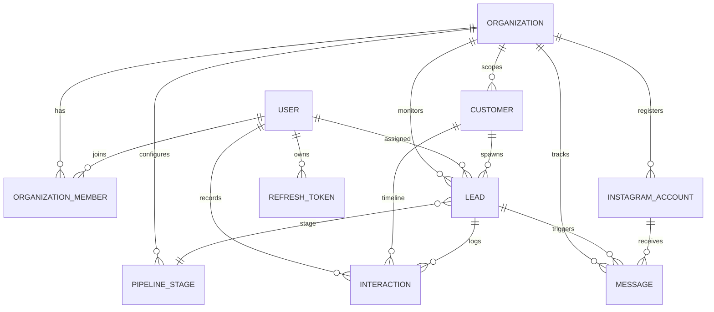

# Database Schema & Relationship Docs

LeadOS uses PostgreSQL managed via Prisma ORM with row-level logical multi-tenant isolation.

## Entity Relationship (ER) Diagram

## Schema Entities Reference

### `Organization`
- `id` (UUID): Primary key.
- `name` (String): Display name of workspace tenant.
- `slug` (String): Unique identifier.
- `logo` / `website` / `industry` (Strings, optional).
- `createdAt` / `updatedAt` (Timestamps).

### `User`
- `id` (UUID): Primary key.
- `email` (String): Unique.
- `password` (String): Bcrypt hashed credentials.
- `firstName` / `lastName` / `avatar` (Strings).
- `isEmailVerified` (Boolean).

### `OrganizationMember`
- `id` (UUID): Primary key.
- `userId` (UUID): Foreign key to User.
- `organizationId` (UUID): Foreign key to Organization.
- `role` (Enum: OWNER, ADMIN, SALES_MANAGER, SALES_EXECUTIVE).
- Unique composite index on `[userId, organizationId]`.

### `Customer`
- `id` (UUID): Primary key.
- `organizationId` (UUID): Scoped relation.
- `firstName` / `lastName` / `email` / `phone` / `company` / `source` (Strings).
- `notes` (String, optional).
- `deletedAt` (Timestamp, for soft deletion support).

### `Lead`
- `id` (UUID): Primary key.
- `organizationId` (UUID): Scoped relation.
- `customerId` (UUID): Foreign key.
- `title` (String): Lead title description.
- `value` (Float): Deal financial size.
- `status` (Enum: NEW, CONTACTED, QUALIFIED, PROPOSAL, WON, LOST).
- `assignedToId` (UUID, optional): Assigned salesperson.
- `pipelineStageId` (UUID, optional): Current stage link.
- `deletedAt` (Timestamp).

### `PipelineStage`
- `id` (UUID): Primary key.
- `organizationId` (UUID): Scoped relation.
- `name` (String): Stage description.
- `order` (Integer): Sort order.
- `color` (String): UI color code.
- Unique composite index on `[organizationId, order]`.
