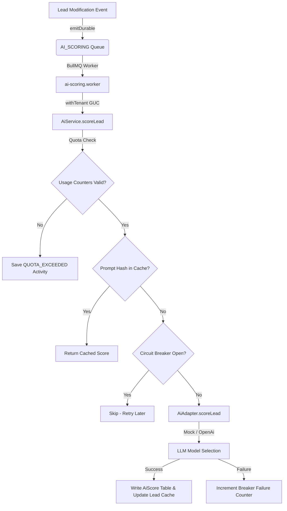

# Milestone 2 — AI Lead Scoring Implementation Checklist

This checklist defines the technical plan, dependencies, file changes, and safety guards required to implement Milestone 2 (AI Lead Scoring) under Sprint 7.

---

## 1. Readiness Audit & Current State Analysis

An audit of the repository at HEAD (`676c1a4aaae50f0db3b4716ee7719770e7bef750`) reveals that Sprint 7 Milestone 1 is completely integrated and validated. 

### 1.1 Local Workspace Draft Code Status
The repository currently contains uncommitted files and modifications pre-scaffolded for Milestone 2:
* **Database Client & Schema:** The `AiUsageCounter` model has been added to `prisma/schema.prisma` and mapped to `ai_usage_counters`. Tenant table trackers are updated to 25 models in `tenant-tables.ts` and `tenant-tables.test.ts`.
* **Prisma Migration:** There is an untracked migration directory `prisma/migrations/0019_ai_usage_counters` which conflicts in sequence numbering with Sprint 7 M1's `0019_activity_conversation_constraint` migration.
* **AI Module Skeletons:** Draft files exist for `ai.adapter.ts` (skeleton `OpenAiAdapter` throwing errors), `ai.service.ts` (complete DB/Redis logic for quotas, caching, and breaker), `ai.service.test.ts` (outdated skeleton tests), and `index.ts`.
* **AI Worker Skeleton:** `apps/api/src/core/queue/workers/ai-scoring.worker.ts` exists but is a throwing stub. It is already registered in `worker-registry.ts`.
* **Shared Types:** AI scoring types and interfaces are declared in `packages/shared/src/types/ai.ts` but are untracked.

### 1.2 Identified Gaps (What is Genuinely Absent)
* Real OpenAI request integration (the `OpenAiAdapter` is a stub).
* Real job processor logic inside `ai-scoring.worker.ts` to coordinate context loading, scoring execution, database writes, and denormalization updates.
* Event emission integration (no trigger points are hooked into `lead.service.ts` yet).
* REST endpoints: `GET /leads/:id/score` and `POST /leads/:id/rescore` are not implemented.
* Frontend/BFF elements: No React components, hooks, or BFF API routes are present.

---

## 2. Milestone 2 Architecture Alignment

Milestone 2 adheres to the load-bearing modular monolith architectural rules:
1. **Async Execution (Inv-2):** AI scoring requests never block user requests; mutations place messages on BullMQ (`ai-scoring` queue) to run in the background.
2. **Atomic Writes (Inv-4):** Score writes, lead denormalization, usage updates, and activity logs execute in a single interactive Prisma transaction using `withTenant`.
3. **Swappable Providers:** The `AiAdapter` abstraction ensures we can mock OpenAI calls in CI/dev environments (`MockAiAdapter`), avoiding live API dependencies and flakiness.
4. **Resiliency:** Enforces a circuit breaker pattern (opens on 5 consecutive failures, blocking calls for 5 minutes), prompt caching (storing sha256 hashes of lead context in Redis), and strict rate-limiting (hourly Redis sliding window + monthly DB counters).

---

## 3. Ordered Implementation Checklist

Below is the structured step-by-step implementation sequence.

### Phase 1: Database & Shared Foundation
* [ ] **Task 1.1: Migration Renaming & Setup**
  * Rename local migration folder from `prisma/migrations/0019_ai_usage_counters` to `prisma/migrations/0020_ai_usage_counters`.
  * Verify the RLS SQL statement maps `current_setting('app.current_organization_id')` correctly.
  * Run `pnpm db:migrate` (or local equivalent) to provision the `ai_usage_counters` table.
* [ ] **Task 1.2: Shared Package Exports**
  * Update `packages/shared/src/types/index.ts` to export all types from `ai.ts`.
  * Ensure `LEAD_SCORED` is properly registered in `packages/shared/src/constants/enums.ts` and `events.ts`.

### Phase 2: Backend Core Implementation
* [ ] **Task 2.1: OpenAI Client Adapter**
  * Modify `apps/api/src/modules/ai/ai.adapter.ts` to implement the `OpenAiAdapter` using direct `fetch` requests or SDK (without new external dependencies where possible). It must parse the model's response and handle model routing (`gpt-4o-mini` default with `gpt-4o` fallback on low confidence).
* [ ] **Task 2.2: AI Prompts Definition**
  * Create `apps/api/src/modules/ai/ai.prompts.ts` with structured instructions directing the LLM to output a clean JSON response matching the `ScoreResult` schema.
* [ ] **Task 2.3: AI Repository**
  * Create `apps/api/src/modules/ai/ai.repository.ts` to encapsulate `AiScore` historical queries and quota updates.
* [ ] **Task 2.4: Queue Worker Completion**
  * Modify `apps/api/src/core/queue/workers/ai-scoring.worker.ts` to implement `processAiScoringJob`. It must:
    * Fetch lead context using `withTenant` with the organization ID from the job payload.
    * Invoke `AiService.scoreLead()`.
    * Save `AiScore` record, update `Lead.aiScore`/`aiScoreUpdatedAt`, and log a `LEAD_SCORED` activity.
    * Check if the delta between the old score and the new score exceeds 10 points; if yes, invoke the notification engine.
* [ ] **Task 2.5: Lead Service Trigger Hook**
  * Modify `apps/api/src/modules/leads/lead.service.ts` to call `emitDurable(..., QUEUE.AI_SCORING, 'score-lead')` on lead creation and lead status changes.

### Phase 3: API REST Endpoints
* [ ] **Task 3.1: Controller & Router**
  * Create `apps/api/src/modules/ai/ai.controller.ts` with `getLeadScore` and `rescoreLead` methods.
  * Create `apps/api/src/modules/ai/ai.routes.ts` mounting these endpoints.
  * Mount the AI router in `apps/api/src/app.ts` under `/api/v1/ai`.

### Phase 4: Frontend Development
* [ ] **Task 4.1: BFF Route Handlers**
  * Create `apps/web/src/app/api/bff/leads/[id]/score/route.ts` to proxy GET requests to `/api/v1/leads/:id/score`.
  * Create `apps/web/src/app/api/bff/leads/[id]/rescore/route.ts` to proxy POST requests to `/api/v1/leads/:id/rescore`.
* [ ] **Task 4.2: React Query Hooks**
  * Create `apps/web/src/lib/hooks/useLeadScore.ts` with `useLeadScore` and `useRescoreLead` hooks.
* [ ] **Task 4.3: UI Components**
  * Create `LeadScoreBadge.tsx` displaying the numeric score (green for high, orange for medium, red for low).
  * Create `LeadScorePopover.tsx` presenting positive/negative scoring factors, recommendation, and a "Recalculate" trigger button.
* [ ] **Task 4.4: UI Wiring**
  * Integrate `LeadScoreBadge` into `LeadTable.tsx` columns.
  * Integrate the score badge and popover into `LeadDetailPage.tsx` header/panels.

### Phase 5: Verification & Hardening
* [ ] **Task 5.1: Unit & Integration Testing**
  * Update `apps/api/src/modules/ai/ai.service.test.ts` to test quota limits, hourly rate-limits, circuit breaker behavior, and prompt cache hit conditions.
  * Create `apps/api/tests/integration/ai-scoring.integration.test.ts` to test end-to-end scoring pipeline, database persistence, and cross-tenant RLS constraints.
  * Verify `pnpm check:rls` equals exactly **25** tenant tables.
  * Run `pnpm typecheck` and `pnpm lint` to verify compliance.

---

## 4. Architectural Map & Dependency Graph

Scoring functions are fully decoupled via queues. Below is the data-flow relationship.



---

## 5. File Modifications List

### 5.1 Files to Create
| Component | File Path | Responsibility |
|---|---|---|
| **Documentation** | `docs/planning/M2_IMPLEMENTATION_CHECKLIST.md` | Order, execution steps, and verification checkpoints |
| **API** | `apps/api/src/modules/ai/ai.controller.ts` | Endpoint request/response handlers |
| **API** | `apps/api/src/modules/ai/ai.routes.ts` | Route setup and permission guards |
| **API** | `apps/api/src/modules/ai/ai.prompts.ts` | LLM prompt instruction context |
| **API** | `apps/api/src/modules/ai/ai.repository.ts` | Usage counters and score db CRUD operations |
| **API Tests** | `apps/api/tests/integration/ai-scoring.integration.test.ts` | Cross-tenant RLS checks and scoring integration suite |
| **Web UI** | `apps/web/src/components/leads/LeadScoreBadge.tsx` | Visual representation of the AI score |
| **Web UI** | `apps/web/src/components/leads/LeadScorePopover.tsx` | Factor details and manual rescore execution modal |
| **Web Hooks** | `apps/web/src/lib/hooks/useLeadScore.ts` | Query hooks for fetching scores & manual triggers |
| **BFF Proxy** | `apps/web/src/app/api/bff/leads/[id]/score/route.ts` | Score retrieval BFF route |
| **BFF Proxy** | `apps/web/src/app/api/bff/leads/[id]/rescore/route.ts` | Score refresh BFF route |

### 5.2 Files to Modify
| File Path | Changes Required |
|---|---|
| `prisma/schema.prisma` | Add `AiUsageCounter` model, back-relation in `Organization`, enforce enums |
| `apps/api/src/core/tenancy/tenant-tables.ts` | Add `ai_usage_counters` to `TENANT_TABLES` / `TENANT_MODELS` |
| `apps/api/src/core/tenancy/tenant-tables.test.ts` | Assert total table count has increased to 25 |
| `apps/api/src/core/queue/worker-registry.ts` | Bind `processAiScoringJob` to `ai-scoring` BullMQ queue |
| `apps/api/src/core/config/env.ts` | Enforce presence of OpenAI variables (`OPENAI_API_KEY`, model parameters) |
| `packages/shared/src/errors/error-codes.ts` | Register `AI_QUOTA_EXCEEDED` and `AI_PROVIDER_UNAVAILABLE` codes |
| `packages/shared/src/types/index.ts` | Export AI-related typescript interfaces |
| `apps/api/src/modules/leads/lead.service.ts` | Dispatch `emitDurable` event on lead creation or status changes |
| `apps/api/src/app.ts` | Register and mount the `/api/v1/ai` routes |
| `apps/api/src/modules/ai/ai.service.test.ts` | Replace throwing skeleton tests with complete assertions |
| `apps/api/src/modules/ai/ai.service.ts` | Verify cache logic, rate limiter checks, and transactional write order |
| `apps/api/src/modules/ai/ai.adapter.ts` | Complete production implementation of `OpenAiAdapter` using `fetch` |
| `apps/api/src/core/queue/workers/ai-scoring.worker.ts` | Connect job processing callback to the active `AiService` |
| `apps/web/src/components/leads/LeadTable.tsx` | Render `LeadScoreBadge` inside table columns |
| `apps/web/src/components/leads/LeadDetailPage.tsx` | Wire-up popovers, badge triggers, and manual rescore buttons |

---

## 6. Migration Sequence & Rollback Strategy

### 6.1 Deployment Sequence
1. Rename local directory from `prisma/migrations/0019_ai_usage_counters` to `prisma/migrations/0020_ai_usage_counters`.
2. Apply migration via `pnpm db:migrate` (runs `CREATE TABLE` + enables PostgreSQL RLS).
3. Confirm RLS is enabled: run `pnpm check:rls` to verify that `ai_usage_counters` is correctly policied (total tables = 25).

### 6.2 Rollback Strategy
If errors occur during the release of Milestone 2:
1. **Application Layer:** Stop and revert the application deployment back to the M1-completed release. The M1 code does not reference `ai_usage_counters` and will ignore the new table.
2. **Database Layer:** If database recovery is necessary, run the following SQL statements against the database (or generate a down-migration):
   ```sql
   DROP POLICY IF EXISTS "ai_usage_counters_org_isolation" ON "ai_usage_counters";
   DROP TABLE IF EXISTS "ai_usage_counters";
   ```
3. **Registry Update:** In Prisma migrations tracking, mark `0020_ai_usage_counters` as rolled back if using automated migration tracking platforms (e.g., Prisma Migrate resolve).

---

## 7. Operational Risk Assessment

| Risk | Threat Level | Mitigation Details | Owner |
|---|---|---|---|
| **Runaway API Bills** | **P0** | Hard monthly billing caps in Postgres counters + hourly Redis sliding window. Prompts cached for 24h using context hashing. Batching of bulk imports to enqueue a single group rescore job. | M2 Worker |
| **Cross-Tenant Data Exposure** | **P0** | Database RLS policy on `ai_usage_counters` table. Redis cache keys prefixed with `organizationId` to segment cache namespaces logically. Prompts run in strict `withTenant` wrapper. | Architecture / DB |
| **OpenAI Outages / Latency** | **P1** | Circuit breaker opens after 5 failures, blocking LLM requests for 5 minutes. Queue retries with exponential backoffs unburden the API and queue. advisory scoring status only. | M2 Service |
| **Test Environment Flakiness** | **P1** | CI execution is guaranteed to use `MockAiAdapter` to bypass third-party dependencies completely. One single smoke test runs in live-integration, flag-guated by env presence. | API Testing |
| **Database Migration Clashing** | **P1** | Sequence numbers are audited. Untracked M2 `0019` migration renamed to `0020` to prevent clash with M1's conversation CHECK constraint migration. | Release / DB |
