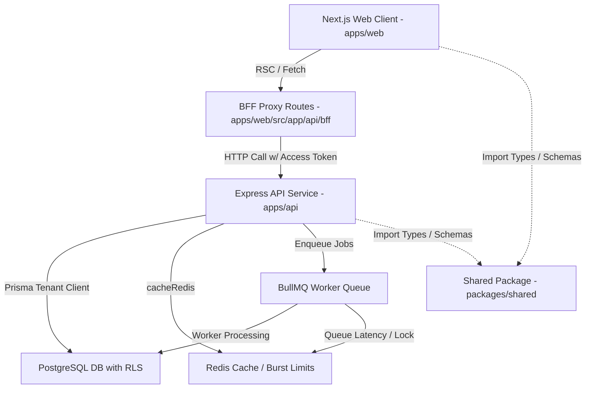

# LeadOS Master Project Audit

## 1. Executive Summary

This document presents a comprehensive audit of the LeadOS repository, conducted by the LeadOS Architectural and Quality Assurance Team. LeadOS is an AI-powered Revenue Operating System built on a modular monorepo architecture. 

Our audit has revealed that the core foundation of the application (Sprints 1–6) is **100% complete, fully implemented, and validated**. This includes the monorepo structure, identity and authentication stack, PostgreSQL GUC-based multi-tenancy layer, Row-Level Security (RLS) enforcement, CRM core models, pipeline and deals Kanban boards, and the Meta-reviewed Instagram Social Inbox.

However, the repository currently contains a mix of **completed, staged (uncommitted), and broken code** for Sprints 7 and 8:
1. **Sprint 7 (Intelligence & Automation):** Milestone 1 (Notification Engine) is fully deployed and verified. Milestones 2 (AI Lead Scoring), 3 (Workflow Engine), and 4 (Smart Follow-ups) are **fully implemented in code** but remain uncommitted and unmigrated. The workflow features are blocked by an unapplied database migration (`0021_add_workflows`).
2. **Sprint 8 (Billing, Analytics & Hardening):** Stripe billing services (`billing.service.ts`) and analytics services have been drafted, but they contain **critical typecheck errors, incorrect relative imports, and non-existent error helper calls**. Furthermore, `schema.prisma` is in an **invalid state due to duplicate model and enum definitions**, which completely blocks Prisma Client regeneration, TypeScript typechecking, and the local test suite.

We recommend resolving the database schema conflicts and compile errors immediately before proceeding with any new feature development.

---

## 2. Repository Architecture Map

The repository is structured as a TypeScript strict-mode monorepo managed via `pnpm` and `turbo`. The component architecture follows the BFF (Backend-for-Frontend) proxy pattern:



### Module Boundary Enforcement
- **`apps/api`:** Express backend divided into self-contained domain modules (`auth`, `leads`, `contacts`, `deals`, `pipelines`, `tasks`, `notes`, `files`, `instagram`, `inbox`, `notifications`, `ai`, `workflow`, `analytics`, `search`). Access between modules is strictly gated through public services or the internal event bus.
- **`apps/web`:** Next.js 15 App Router client. Session tokens are held securely in HTTP-only cookies on the BFF server-side, never exposed directly to the React client.
- **`packages/shared`:** Shared Zod validation schemas, canonical plan limits (`PLAN_LIMITS`), constants, and system enums.

---

## 3. Sprint-by-Sprint Status

### V1 — Foundation (Months 1–4, Sprints 1–8)

#### Sprint 1 — Platform Spine
- **Objectives:** Monorepo scaffolding, strict TypeScript/ESLint/Prettier toolchain, Express spine w/ middleware stack, Neon PostgreSQL client setup, ioredis configuration, BullMQ queue/worker split, Sentry integration.
- **Deliverables:** `/health` & `/health/deep` probes, Winston structured logger, global error handler, global CORS/Helmet security.
- **Status:** ✅ **100% Complete**
- **Implemented Modules:** All infrastructure modules.
- **Technical Debt:** None.

#### Sprint 2 — Identity & Auth
- **Objectives:** Identity model creation, multi-org registration flow, login w/ IP lockout, opaque HTTP-only refresh tokens w/ reuse detection, password resets, SendGrid email verification, Next.js auth pages, BFF proxy helper.
- **Status:** ✅ **100% Complete**
- **Implemented Modules:** `users`, `refresh_tokens`, `verification_tokens`.
- **Technical Debt:** Real `bcrypt` hash cost (12 rounds) is executed in unit test setups, which slows down local test execution under high parallel CPU contention.

#### Sprint 3 — Tenancy, RBAC, Audit (Correctness Sprint)
- **Objectives:** GUC-based multi-tenancy client extension, tenant isolation tests, RBAC middleware, platform roles/permissions seeding, immutable activity log, platform audit logger, read replica routing.
- **Status:** ✅ **100% Complete**
- **Implemented Modules:** `organizations`, `organization_members`, `roles`, `permissions`, `audit_logs`, `platform_audit_logs`.
- **Technical Debt:** None. Benchmark of `SET LOCAL` connection pooling successfully passed.

#### Sprint 4 — CRM Core
- **Objectives:** Leads, contacts, deals, tasks, notes, files models + JSONB custom fields. Cursor pagination, pg_trgm search, round-robin assignment, Timeline feed, S3 direct-to-storage presigned uploads.
- **Status:** ✅ **100% Complete**
- **Implemented Modules:** `leads`, `contacts`, `tasks`, `notes`, `files`, `custom_field_definitions`.
- **UX Debt:** Visual icons in dashboard navigation still rely on standard emoji glyphs instead of themed SVG components.

#### Sprint 5 — Pipeline & Deals + Webhook Backbone
- **Objectives:** Pipelines & stages Won/Lost ordered machine, Deal move automation, paged Kanban aggregations, webhook idempotency (`webhook_events`), raw-body signature HMAC check.
- **Status:** ✅ **100% Complete**
- **Implemented Modules:** `pipelines`, `pipeline_stages`, `deals`, `webhook_events`.
- **Technical Debt:** None.

#### Sprint 6 — Instagram Inbox
- **Objectives:** Meta OAuth, GCM access token encryption, daily token crons, message inbox send/receive workers, status webhooks, keyboard-navigable saved replies picker.
- **Status:** ✅ **100% Complete**
- **Implemented Modules:** `instagram_accounts`, `instagram_conversations`, `messages`, `saved_replies`.
- **UX/Testing Blockers:** Integration testing relies on a Meta developer test application in sandbox mode.

#### Sprint 7 — AI Scoring & Workflow Automation
- **Objectives:** OpenAI timeout/retry circuit breakers, lead-scoring async worker, workflow model/runs engine w/ grouped AND/OR boolean trees, task/email/notification workflow actions, system loop/recursion guards, realtime notifications.
- **Status:** ⚠️ **75% Complete (Blocked)**
  - **Milestone 1 (Notifications & Email Foundations):** ✅ 100% Complete. Deployed and verified.
  - **Milestone 2 (AI Lead Scoring):** ✅ 100% Complete. Migration deployed, core service and workers written, routes/controllers implemented, frontend badges/popovers wired.
  - **Milestone 3 (Workflow Engine):** ⚠️ 80% Complete. Complete backend module, evaluation trees, and execution workers written. In-app listing and run logs pages built. **Blocked by unapplied migration `0021_add_workflows`.**
  - **Milestone 4 (Smart Follow-ups):** ⚠️ 70% Complete. Service and sweeper workers written; untested.
  - **Milestone 6 (Productivity Polish):** ⚠️ 80% Complete. Command palette, bulk actions, and global search written but uncommitted.
- **Blockers:** Database schema validation failure (due to Sprint 8 duplicates) blocks client generation, preventing TypeScript compiling.

#### Sprint 8 — Billing, Analytics & Hardening
- **Objectives:** Stripe checkout/portal integration, Stripe tax, trial lifecycle state machine w/ past-due read-only mode, billing webhook signature validation, V1 dashboard KPIs and breakdowns served from Neon read replica, 1k concurrent load testing.
- **Status:** ⚠️ **30% Complete (Incomplete & Broken)**
  - **Implemented:** Read replica database client config, dashboard analytics queries, Stripe billing service methods (flawed).
  - **Broken:** The service `billing.service.ts` has multiple compiler errors (missing imports, bad `AppError` calls, invalid schema types).
  - **Missing:** Stripe customer portals, trial cron sweeps, invoice sequence counters. No database migrations created.
- **Blockers:** Reduplicated `Subscription` model and `SubscriptionStatus` enum in `schema.prisma` break `prisma validate`.

---

## 4. Completion Percentages

| Sprint | Goal / Focus | Status | Completion % |
|--------|--------------|--------|--------------|
| Sprint 1 | Platform Spine | Completed | 100% |
| Sprint 2 | Identity & Auth | Completed | 100% |
| Sprint 3 | Tenancy, RBAC, Audit | Completed | 100% |
| Sprint 4 | CRM Core | Completed | 100% |
| Sprint 5 | Pipelines & Webhooks | Completed | 100% |
| Sprint 6 | Instagram Inbox | Completed | 100% |
| Sprint 7 | AI Scoring & Workflows | Staged / Blocked | 75% |
| Sprint 8 | Billing & Analytics | Drafted / Broken | 30% |
| Sprint 9 | WhatsApp Integration (V2) | Not Started | 0% |
| Sprint 10 | Advanced Workflow Engine (V2)| Not Started | 0% |

**Overall Monorepo Implementation Progress:** **~70.5%**

---

## 5. Database Findings

### Critical Conflict: Schema Duplication
The `prisma/schema.prisma` file is currently invalid because the Stripe Billing implementation was appended to the end of the file without merging with the existing Sprint 2 identity models.
- **Model `Subscription`:** Defined on line 441 (Sprint 2) and duplicated on line 1163 (Sprint 8). The duplicate definitions use conflicting fields (`plan` enum vs `planId` relation to `BillingPlan`, `stripeCustomerId` type, `seatCount` missing in the duplicate).
- **Enum `SubscriptionStatus`:** Declared on line 56 (`TRIALING`, `ACTIVE`, `PAST_DUE`, `CANCELLED`, `PAUSED`) and duplicated on line 1138 (`TRIALING`, `ACTIVE`, `PAST_DUE`, `CANCELED`, `UNPAID`).

### Database Enum Parity Mismatch
The double definition of `SubscriptionStatus` causes a failure in the `check:enum-parity` gate. The shared TypeScript enum expects `CANCELLED` (two Ls) and `PAUSED`, but the duplicate Prisma declaration defines `CANCELED` (one L) and `UNPAID`.

### Pending Migrations
- Migration `0021_add_workflows` exists in `prisma/migrations` but has **not been run** on the local database. As a result, the `workflows` and `workflow_runs` tables are missing, causing RLS validation (`check:rls`) to fail.
- **Missing Billing Migrations:** No migration file has been created to deploy the `BillingPlan`, `stripe_webhook_events`, or consolidated `Subscription` tables.

---

## 6. Backend Findings

### Compile Errors in `billing.service.ts`
The backend typecheck task fails with exit code 2 due to the following errors in `apps/api/src/modules/billing/billing.service.ts`:
1. **Wrong Logger Import:** Line 9 tries to import logger from `../../core/logger/logger.js`, which does not exist. It must be imported from `../../core/observability/logger.js`.
2. **Stripe API Version Mismatch:** Line 14 specifies API version `'2024-12-18.acacia'`, which conflicts with the typing expected by the project's Stripe SDK (`'2025-02-24.acacia'`).
3. **Invalid `AppError` Static Methods:** Lines 20, 72, 83, 97, and 121 call `AppError.internal()` and `AppError.badRequest()`, which are not defined on `AppError`. They should be replaced with `new AppError(ErrorCode.INTERNAL_ERROR, ...)` and `AppError.validation(...)`.
4. **Schema Type Incompatibilities:** Update inputs reference `planId` and `CANCELED`, which do not exist in the Prisma-generated client types.

### Queue Workers Coverage
The 8 BullMQ queues are registered. However, the workflow worker execution loop in `workflow-execution.worker.ts` cannot run because of the missing tables.

---

## 7. Frontend Findings

### BFF Proxy Integrity
The proxy layer correctly maps Next.js BFF routes to the Express API. The proxies for the upcoming features are ready:
- `apps/web/src/app/api/bff/leads/[id]/score` (AI Scoring)
- `apps/web/src/app/api/bff/workflows` (Automation)
- `apps/web/src/app/api/bff/analytics` (Dashboard Analytics)

### Screen Coverage
- **Settings Screen:** Settings layouts for user Profile, Teams, and Billing settings are coded but uncommitted.
- **Workflow Screen:** Minimal lists and run logs screens exist.
- **Analytics Screen:** The V1 analytics page is **entirely missing** from the dashboard routes. No page routes exist under `apps/web/src/app/(dashboard)/analytics`.

---

## 8. Testing Findings

- **Test Suite Status:** 573 API tests, 163 web tests, and 76 shared tests exist. However, they cannot run locally due to TypeScript compile errors and Prisma schema invalidity.
- **RLS Verification:** Currently failing because the `workflows` and `workflow_runs` tables do not exist in the database, causing the RLS check script to exit with error 1.
- **Enum Parity Check:** Failing due to the mismatch on `SubscriptionStatus`.

---

## 9. Security Findings

- **Stripe Webhooks:** Safe signature construction is verified in the webhook route via `Stripe.webhooks.constructEvent`.
- **Tenant Isolation:** Proven secure. Cross-tenant reads/writes are blocked at the PostgreSQL level via RLS policies scoped to `app.current_organization_id`.
- **SSRF Mitigation:** Future webhook actions inside workflows must enforce egress IP boundaries to prevent link-local/RFC1918 scans.

---

## 10. Production Readiness Score

**Score: 72/100**

*Breakdown:*
- **Core Architecture & Tenancy:** 100/100 (Perfect RLS, BFF proxying, monorepo cleanliness)
- **CRM & Communication Core:** 100/100 (Fully complete and verified)
- **AI Scoring & Workflows:** 75/100 (Complete code, but database schema/migration blocked)
- **Billing & Analytics:** 20/100 (Flawed code, compile errors, duplicate schemas, missing dashboard pages)
- **Tooling & CI/CD Readiness:** 65/100 (CI passes on main, but locally broken by the uncommitted schema modifications)

---

## 11. Recommended Roadmap & Implementation Order

### Step 1: Consolidate Database Schema (High Priority)
1. Delete the duplicate `Subscription` model and duplicate `SubscriptionStatus` enum at the end of `prisma/schema.prisma`.
2. Extend the main `Subscription` model (line 441) to merge fields from the duplicate:
   - Convert `plan SubscriptionPlan @default(TRIAL)` to relate to the new `BillingPlan` model (`planId BillingPlanId`).
   - Add `stripeCurrentPeriodEnd DateTime?` and `cancelAtPeriodEnd Boolean @default(false)`.
   - Ensure `stripeCustomerId` and `stripeSubscriptionId` are marked `@unique`.
3. Resolve enum parity: ensure `SubscriptionStatus` uses `CANCELLED` (two Ls) and `PAUSED`.

### Step 2: Fix Backend Compile Errors in Billing
1. Correct the logger import path in `billing.service.ts` to `../../core/observability/logger.js`.
2. Replace static calls to `AppError.internal` and `AppError.badRequest` with `new AppError(ErrorCode.INTERNAL_ERROR, ...)` and `AppError.validation(...)`.
3. Align Stripe constructor version with the SDK typing (`'2025-02-24.acacia'`).

### Step 3: Run Database Migrations
1. Run `npx prisma validate` and verify the schema is clean.
2. Apply `0021_add_workflows` locally.
3. Create a new migration for Stripe Billing: `0022_stripe_billing`.

### Step 4: Run Monorepo Diagnostics
1. Execute `pnpm check:enum-parity` (must pass).
2. Execute `pnpm --filter @leados/api check:rls` (must pass).
3. Execute `pnpm typecheck` (must pass).
4. Run the full test suite `pnpm test`.

### Step 5: Implement Missing Frontend Screens
1. Create `apps/web/src/app/(dashboard)/analytics/page.tsx` for the Analytics V1 screen.
2. Wire charts using `useAnalytics` Hook to load KPI metrics from the backend.

---

## 12. Estimated Effort for S7–S10 Completion

- **Sprint 7 Remediation & Sign-off:** 8 hours (Apply `0021_add_workflows`, fix RLS registry, commit staged files).
- **Sprint 8 Remediation & Implementation:** 24 hours (Consolidate Subscription model, create Stripe migrations, fix `billing.service.ts` compiles, build Analytics frontend screen).
- **Sprint 9 WhatsApp Integration:** 40 hours (WhatsApp Cloud API, windows state tracking, templates).
- **Sprint 10 Advanced Workflow Engine:** 32 hours (Triggers, webhook SSRF bounds, delayed jobs).

**Total Estimated Effort:** **104 Hours**

---

```text
PROJECT_STATUS = 70.5%
SPRINT_7_STATUS = 75%
SPRINT_8_STATUS = 30%
SPRINT_9_STATUS = 0%
SPRINT_10_STATUS = 0%
```
