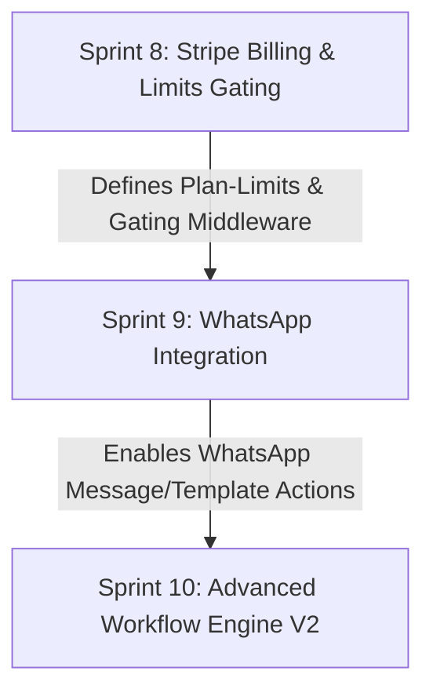

# Sprints 8-10 Master Execution Plan

This master plan coordinates the sequential implementation of **Sprint 8 (Billing)**, **Sprint 9 (WhatsApp)**, and **Sprint 10 (Advanced Workflows)** for the LeadOS Revenue Operating System.

---

## 1. Dependency Graph & Critical Path

The dependency flow between modules is strictly linear:



### Critical Path Analysis
1. **Sprint 8 (Billing):** Must be fully implemented first to provide plan limit parameters (e.g., `whatsappAccounts`, `activeWorkflows`) and the `billingGuard` middleware that enforces access limits across all tenant accounts.
2. **Sprint 9 (WhatsApp):** Introduces phone number setups and message history models required by workflow actions.
3. **Sprint 10 (Advanced Automation):** Introduces delayed executions and integrates WhatsApp triggers and actions.

---

## 2. Database Migration Order

Database migrations must be applied sequentially to prevent dependency failures:

| Order | Migration Name | Applied Tables / Actions |
|-------|----------------|--------------------------|
| 1 | `0022_stripe_billing` | Deploys `billing_plans`, `stripe_webhook_events`, alters `subscriptions` table. |
| 2 | `0023_whatsapp_integration` | Deploys `whatsapp_accounts`, `whatsapp_templates`, alters `conversations` (window tracker). |
| 3 | `0024_workflow_delays` | Alters `workflow_runs` to support paused step states. |

---

## 3. Implementation Plan

### Phase A: Sprint 8 (Billing, Analytics & Hardening)
1. **Database Schema:** Create migration `0022_stripe_billing` and update the local database. Seed pricing details.
2. **Billing API Endpoints:** Implement routes `/checkout`, `/portal`, `/subscription` in `billing.routes.ts`.
3. **Derived Access Level Logic:** Implement derived `effectiveAccessLevel` and the `billingGuard` middleware to enforce trial expiration or PAST_DUE limits.
4. **Idempotent Webhook Processing:** Connect `BillingService.processWebhookEvent()` to the Stripe dispatcher in the background webhook worker queue.
5. **Drift Reconciliation:** Build a nightly cron job to sync database records with Stripe subscription lists.
6. **Frontend Integration:** Connect the React settings billing page to the new BFF routes.

### Phase B: Sprint 9 (WhatsApp Integration)
1. **Database Schema:** Create migration `0023_whatsapp_integration`.
2. **Meta Cloud API Adapter:** Build the Cloud API client to send template and free-form messages.
3. **WABA Setup Flow:** Build Embedded Signup redirect routes and secure access token storage.
4. **Inbound Webhook Receiver:** Implement `/api/webhooks/whatsapp` signature validation and worker dispatchers.
5. **Broadcast Campaign Builder:** Implement bulk sending logic using rate-limited BullMQ queues.
6. **Unified Inbox:** Render WhatsApp threads, template selectors, and 24h window labels.

### Phase C: Sprint 10 (Advanced Workflows)
1. **Delay Node Execution:** Implement delayed step executions using BullMQ delayed queues.
2. **Outbound Webhook Actions:** Build the HTTP webhook post worker with strict SSRF private IP validation.
3. **WhatsApp Action Integration:** Connect template messaging actions to workflow executions.
4. **Visual Canvas Interface:** Integrate React Flow to support visual workflow design in the web dashboard.
5. **Execution Guardrails:** Implement loop depth limits to prevent infinite execution chains.

---

## 4. Rollback Strategy

* **PostgreSQL Schema Rollback:**
  If a migration fails or introduces performance degradation, run:
  ```bash
  npx prisma db push --force-reset
  # Re-apply migrations up to the last stable state.
  ```
* **Stripe Webhook Fallback:**
  If live updates lag, rely on manual Stripe Customer Portal redirects and the nightly reconciliation script to restore plan statuses.
* **Meta Cloud Callback Rollback:**
  In the event of webhook drops, use Meta's message status API query fallbacks to reconcile lost conversation details.

---

## 5. Risk Assessment & Mitigation

| Risk | Impact | Likelihood | Mitigation Strategy |
|------|--------|------------|---------------------|
| Stripe Webhook Event Drops | High | Medium | Nightly cron reconciliation diffs and resolves database drift automatically. |
| Outbound Webhook SSRF | Critical | Low | Webhook action client blocks private, loopback, and multicast IP ranges. |
| WhatsApp Window Lockouts | Medium | High | Render clear warnings on the frontend showing the remaining time in the 24h window. |
| Workflow Infinite Loops | High | Medium | Prevent loop exhaustion by restricting call stacks to a maximum of 10 nested steps. |

---

## 6. Testing Strategy

1. **Stripe Billing Integration Tests:**
   Mock Stripe SDK checkout creation and event signatures.
2. **Meta Cloud Webhook Integration Tests:**
   Mock inbound message events and verify correct lead creation and 24h window updates.
3. **Workflow Automation Integration Tests:**
   Assert correct execution logs, condition matching, and delay schedules.

---

## 7. Acceptance Criteria

- All validation check gates are green (PASS).
- Multi-tenant GUC RLS separation tests pass without failures.
- No `any` type casts used.
- Web browser build completes without compilation errors.
